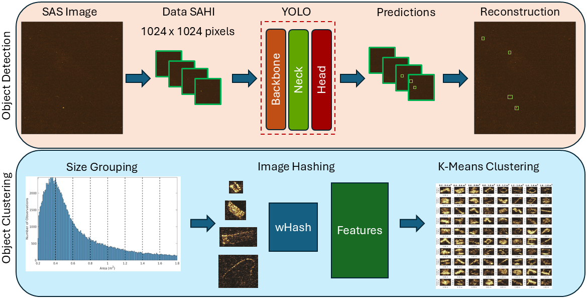

# YOLO-SAHI_Detection
This work provides code that combines YOLO and SAHI for large-scale imagery. This code was originally used to train you-only-look-once (YOLO) models with sliced aided hyper inference (SAHI) to localize and detect small objects in synthetic aperture sonar (SAS) imagery. This work can be extended to wide-area imagery with a few tweaks to the code. The code provided can be used to train a detection model for the training, validation, and test sites. The figure provided highlights the procedure for SAS small-object identification and characterization. This work uses a two-fold detection and characterization approach that allows for less rigid classification and further analysis of objects in sonar data. 

# Instructions
## Installation
To install the required Python packages, use:

```
pip install requirements.txt
```

## Manual Installation
If you want to manually install the Ultralytics package, you can do so by going to the website and finding the conda version you want. Link provided here:

https://docs.ultralytics.com/quickstart/

Then install the other packages:

```
pip install sahi numpy pillow imagehash scipy matplotlib
```

## Base Models
Please go to Ultralytics at: https://docs.ultralytics.com/models/ and select the YOLO models you want. We specifically chose YOLO models 8-10 for simplicity and have provided the specific links to the models here:

| YOLO 8 | YOLO 9 | YOLO 10 | YOLO 11 |
| -------- | -------- | -------- | -------- |
| [YOLO8L](https://github.com/ultralytics/assets/releases/download/v8.4.0/yolov8l.pt) | [YOLO9L](https://github.com/ultralytics/assets/releases/download/v8.4.0/yolov9c.pt) | [YOLO10L](https://github.com/ultralytics/assets/releases/download/v8.4.0/yolov10l.pt) | [YOLO11L](https://github.com/ultralytics/assets/releases/download/v8.4.0/yolo11l.pt) |

# How to Use

### Step 1) 
Download or fork the repository and install the requirements.txt. I personally like to do so in an Anaconda environment so as not to have to worry about any package issues.

### Step 2) 
Use your favorite annotation software (e.g., MATLAB image labeler, CVAT, LabelImg, etc.) and export annotations into a YOLO format. This should provide you with (class_id, x_center, y_center, width, height). 

### Step 3) 
Edit the  [Train_Data_Slicer.py](Train_Data_Slicer.py) to the file paths and outputs you want. I point out a few of the variables below:

> [!NOTE]
>| Variable | Description |
>| -------- | -------- | 
>|image_dir | Directory for the large image you labeled. |
> | yolo_label_dir | Directory to the txt files with the same names as the images, this should be in a yolo format. |
> | small_images_dir | New directory for the smaller labeled images. |
> | small_labels_dir | New directory for the labels of the smaller images. |
> | output_json_path | COCO JSON file of the original YOLO annotations. This is necessary for SAHI to slice the data. |
> | json_file_path | New JSON file that converts from the COCO format back to YOLO to train the YOLO models (smaller images) |
> | New_height, New_Width | Number of pixels in height and width of new, smaller images |
> | Height_overlap, Width_overlap | Amount of overlap in height and width of new, smaller images in %/100 |
> | class_names | class names and ids, e.g., 0: 'Name' |

### Step 4)
Data should be structured for training and validation, as seen below.


From this structure, we create a .yaml file pointing to the directory. Example below:

```
# Dataset root directory
path: Root/Data # directory where the training and validation folders are

# Train/val/test sets: specify directories
train: Images/Train # images for training
val: Images/Test # images for testing

nc: 1 # number of classes
# Classes id number and name
names:
    0: Name
```


### Step 5)
Train your model using [Train.py](Train.py). You will need to set the following parameters in the file:
> [!NOTE]
>| Variable | Description |
>| -------- | -------- | 
>| model_name | Base model that is downloaded from above. |
> | yaml_file | The .yaml file that was made in step 4 for the model to use for training and validation. |
> | perf_file | File name to save the performance of the model. This can be used to see the performance curves of the model. |
> |epochs| Number of training epochs. |
> |imgsz| Adjusted size of each image for YOLO model. |
> |batch| Batch size of images to use for training. |
> |test_model| Test the model with the testing data defined in .yaml. |
> |output_test_file| File name to save the testing performance of the model. |

### Step 6)
Edit [pred_yolo_sahi.py](pred_yolo_sahi.py) to the file paths and desired parameters. I point out a few of the variables below:

> [!NOTE]
>| Variable | Description |
>| -------- | -------- | 
>| dir_image_path | Directory for the large image you want to predict. |
> | model_weights | File that contains the trained weights of the YOLO model, usually .pt file. |
> | det_threshold | Threshold for detection (confidence score). |
> | device | Device to run predictions on (e.g., "cpu" or "cuda:0"). |
> | Image_height, Image_width | Image height and width of the smaller slices SAHI uses. |
> | Overlap_height,Overlap_width | Amount of overlap of the smaller images in %/100 |
> | crop_image | True or False if you want to crop the individual detected object and save it as a new .png file. This will allow you to do more unsupervised work later.|
> | cropped_image_dir | Directory for cropped image. |

### Step 7) 
Edit [imagehashing.py](imagehashing.py) to apply feature extraction to the cropped images through wavelet hashing. 
> [!NOTE]
>| Variable | Description |
>| -------- | -------- | 
>| cropped_images_path | String of the directory that points toward the cropped images. |
>| output_features_name | Name of the file that outputs the features extracted from each image crop. |

### Step 8)
Run [Cropped_clustering.m](Cropped_clustering.m) in MATLAB to cluster the cropped image features. Please note, I switched to MATLAB here because I am more comfortable with it. If you don't have MATLAB, I suggest using [clustimage](https://github.com/erdogant/clustimage), [scikit-learn](https://scikit-learn.org/stable/), or any other Python-based clustering package. In the MATLAB file, I go deeper into the analysis I did in the paper.

> [!NOTE]
>| Variable | Description |
>| -------- | -------- | 
>| px, py | Resolution of pixels in any units (I use meters). |
>| cropped_image_dir | Image directory to your cropped images from the previous code. |
> | feature_data_name| Name of the file with the features that were extracted from previous code.|
> | area_limits| Limits to the sizes that you are looking for. This should be (lower upper) values. |
> | step_size| Bin size of grouping for your area sizes. |
> | area_groups| The search and bins of the areas you want to cluster. |
> | number_clusters_explore| Number of K-means clusters to explore, starting from 2 clusters. |
> | save_name| File name to save to for the information on clustering. Can be used to do further analysis.|

## Data 
We provide data that was used to train the small-object detection algorithm for our publiction at: 

```
McCarthy, Ryan; Merrifield, Sophia; Terrill, Eric (2026), “SAS Acoustic Imagery Dataset to Train Small-Object Detection”, Mendeley Data, V1, doi: 10.17632/3sr9ddgbrf.1
```

## Citation
To learn more about the use of this, please check out the paper here. If you find this useful or implement parts of the above code, consider citing the work behind this.
```
McCarthy, R. A., 
```
